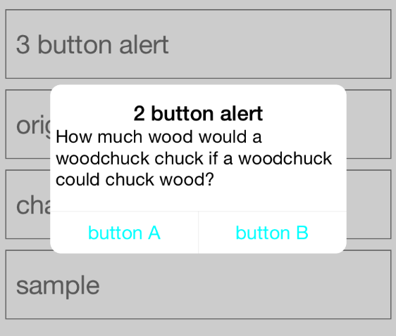

KKAlertView
====

[](https://developer.apple.com/iphone/index.action)
[](https://developer.apple.com/swift)
[](http://cocoapods.org/pods/KKAlertView)
[](http://cocoapods.org/pods/KKAlertView)

   


[kazuteru/KKAlertView]
(https://github.com/kazuteru/KKAlertView) - You can easily display AlertView with the original animation like Path


## Features

- [x] AlertView with the original animation like Path
- [x] You can easily add an original animation to AlertView

## Installation

#### CocoaPods

KKAlertView is available through [CocoaPods](http://cocoapods.org). If you have cocoapods 0.36.0 or greater, you can install
it, simply add the following line to your Podfile:

    pod "KKAlertView"

#### Manually

Add the [KKAlertView](./KKAlertView) directory to your project. 

## Usage

If you install from cocoapods, You have to write `import KKAlertView`.

#### Code

You can use KKAlertViewController like UIAlertConroller.

```swift
	let alertViewController = KKAlertViewController(title: "2 button alert", message: "How much wood would a woodchuck chuck if a woodchuck could chuck wood?")
	alertViewController.addAction(title: "button A", action: { println("Hello EX1") })
    alertViewController.addAction(title: "button B", action: { println("Hello EX2") })
    alertViewController.showAlert()
}
```
 

## Requirements

- Xcode 6.1 or greater
- iOS7.0(manually only) or greater

## Author
Kobashi Kazuki, [kazuteru.koba@gmail.com](kazuteru.koba@gmail.com)

## License

KKAlertView is available under the MIT license. See the LICENSE file for more info.